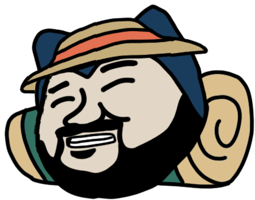

 

  Graphic by <a href="https://github.com/nileplumb" target="_blank">nileplumb</a>

# Kōji

  

## What is Kōji?

- Automation tool to streamline the process of mapping new and existing areas as efficiently as possible
- Fully interactive client for creating and editing geofences
- Admin panel for managing geofences, routes, projects
- External API to seamlessly integrate into your mapping workflow
- Kōji is named after [Kōji Nishino](https://bulbapedia.bulbagarden.net/wiki/K%C5%8Dji_Nishino)

## Docs

Documentation for this project can be found [here](https://koji.vercel.app/)
