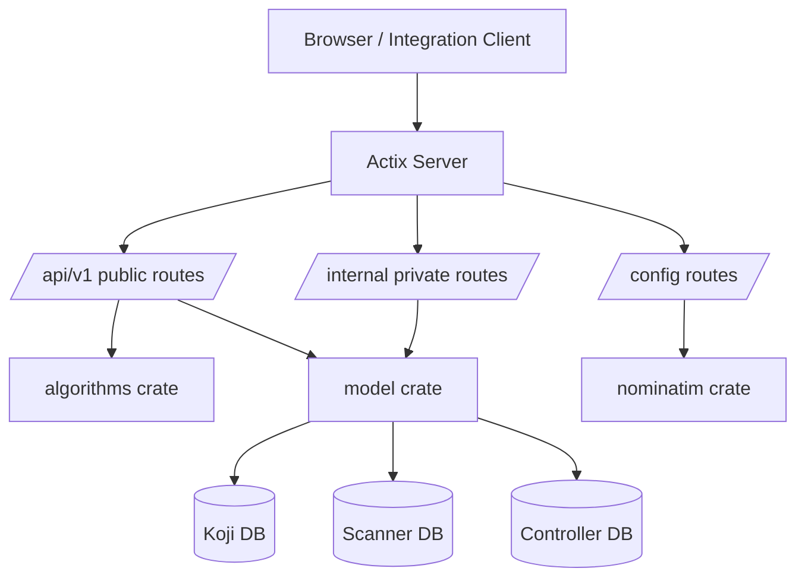

import { Callout, FileTree } from 'nextra/components'

# Repository Architecture

This page maps source folders to runtime behavior so contributors can find code faster.

## Top-Level Layout

<FileTree>
  <FileTree.Folder name="server" defaultOpen>
    <FileTree.File name="Cargo.toml (workspace root + binary)" />
    <FileTree.Folder name="src">
      <FileTree.File name="main.rs (startup + dotenv + logger)" />
    </FileTree.Folder>
    <FileTree.Folder name="api">
      <FileTree.File name="Actix handlers and routing scopes" />
    </FileTree.Folder>
    <FileTree.Folder name="algorithms">
      <FileTree.File name="clustering/routing/bootstrap implementations + plugins" />
    </FileTree.Folder>
    <FileTree.Folder name="model">
      <FileTree.File name="DB models, query layer, scanner adapters" />
    </FileTree.Folder>
    <FileTree.Folder name="migration">
      <FileTree.File name="SeaORM migrations" />
    </FileTree.Folder>
    <FileTree.Folder name="nominatim">
      <FileTree.File name="Nominatim API client wrapper" />
    </FileTree.Folder>
    <FileTree.Folder name="macros">
      <FileTree.File name="proc macros used by server crates" />
    </FileTree.Folder>
  </FileTree.Folder>
  <FileTree.Folder name="client" defaultOpen>
    <FileTree.File name="Vite React app (map + admin UI)" />
    <FileTree.Folder name="src">
      <FileTree.File name="pages/map (map editor and calculations)" />
      <FileTree.File name="pages/admin (resource CRUD UI)" />
      <FileTree.File name="services (API fetchers + parsing)" />
      <FileTree.File name="components (drawer/dialog/controls)" />
    </FileTree.Folder>
  </FileTree.Folder>
  <FileTree.Folder name="docs" defaultOpen>
    <FileTree.File name="Nextra docs site (this documentation)" />
  </FileTree.Folder>
  <FileTree.Folder name="or-tools">
    <FileTree.File name="OR-Tools plugin build sources" />
  </FileTree.Folder>
  <FileTree.File name="Dockerfile (multi-stage client + server + OR-Tools build)" />
  <FileTree.File name="docker-compose.yml" />
</FileTree>

## Runtime Request Flow

## Rust Workspace Crates

- `server`: binary entrypoint and workspace root.
- `server/api`: HTTP layer, auth, route wiring, request/response shaping.
- `server/algorithms`: clustering, routing, bootstrap logic and plugin execution.
- `server/model`: SeaORM models/query helpers and scanner-specific data access.
- `server/migration`: database schema migrations.
- `server/nominatim`: geosearch client abstraction.
- `server/macros`: shared proc macros.

<Callout type="info">
  The public API contract lives under `/api/v1/*`. Admin UI helpers use
  `/config/*` and `/internal/*`.
</Callout>
