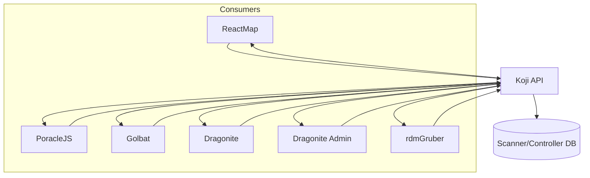

import { Callout, Steps } from 'nextra/components'
import { GitHubLogo } from '../../components/GitHub'

# External Integrations

In Kōji's architecture, various external integrations primarily leverage HTTP `GET` requests for data retrieval. These integrations can be configured to fetch the latest updates either during the initialization phase of a process or based on a predefined schedule. Additionally, Kōji supports an event-driven approach where it can proactively trigger updates in external services. This mechanism enables synchronization with Kōji's latest state changes, enhancing the responsiveness and efficiency of the integrated systems.



## ReactMap

- Remove the need to have an `areas.json` file by loading your managed geofences straight from Kōji
- You must set two config values to use Kōji with ReactMap

<Steps>

#### First set your Kōji Bearer Token:

- `api.kojiOptions.bearerToken`
- Your Kōji Bearer token

#### Then set ReactMap to call the Kōji API

- `map.general.geoJsonFileName`
- Example: `http://{koji_ip}/api/v1/geofence/feature-collection/{project_name}`

<Callout type="info" emoji="💡">
  You can use unique project names for Multi-Domain setups!
</Callout>

</Steps>

### Project setup

This is configured inside your Kōji `/admin/project` and will allow hot reloading of your areas within ReactMap.

```yml
API Endpoint: http://{reactmap_ip}:{port}/api/v1/area/reload
API Key: react-map-secret:{config.api.reactMapSecret}
```

### Supported Features

- Polygons ✅
- MultiPolygons ✅

<GitHubLogo title="ReactMap" href="https://github.com/WatWowMap/ReactMap" />

## PoracleJS

- Remove the need to have a `geofence.json` file by loading your managed geofences straight from Kōji.
- You must set two config values to use Kōji with Poracle

<Steps>

#### First set your Kōji Bearer Token:

- `config.geofence.kojiOptions.bearerToken`
- Your Kōji Bearer token

#### Then set Poracle to call the Kōji API upon startup

- `config.geofence.path`
- Example: `http://{koji_ip}/api/v1/geofence/poracle/{project_name}`

</Steps>

### Project setup

This is configured inside your Kōji `/admin/project` and will allow hot reloading of your areas within PoracleJS.

```yml
API Endpoint: http://{poraclejs_ip}:{port}/api/geofence/reload
API Key: X-Poracle-Secret:{config.server.apiSecret}
```

### Supported Features

- Polygons ✅
- MultiPolygons ½ (PoracleWeb and `!area show` does not support MultiPolygons)

<GitHubLogo title="PoracleJS" href="https://github.com/KartulUdus/PoracleJS" />

## Golbat

- Remove the need to have a `geofence.json` file by loading your managed geofences straight from Kōji
- You must set two config values to use Kōji with Golbat

<Steps>

#### First set your Kōji Bearer Token:

- `koji.bearer_token`
- Your Kōji Bearer token

#### Then set Golbat to call the Kōji API upon startup

- `koji.url`
- Example: `http://{koji_ip}/api/v1/geofence/feature-collection/{project_name}`

</Steps>

### Project setup

This is configured inside your Kōji `/admin/project` and will allow hot reloading of your areas within Golbat.

```yml
API Endpoint: http://{golbat_ip}:{port}/api/reload-geojson
API Key: x-golbat-secret:{golbat_config.api_secret}
```

### Supported Features

- Polygons ✅
- MultiPolygons ✅

<GitHubLogo title="Golbat" href="https://github.com/UnownHash/Golbat" />

## Dragonite

- You must set two config values to use Kōji with Dragonite

<Steps>

#### First set your Kōji Bearer Token:

- `koji.bearer_token`
- Your Kōji Bearer token

#### Then set the Kōji url

- `koji.url`
- Example: `http://{koji_ip}`

</Steps>

### Project Setup

Use these values for your "scanner project" if Koji and Dragonite are on the **same** network.

```yml
API endpoint: http://{drago_host_ip}:{drago_port}/reload
API key: Leave empty. Dragonite currently does not support authentication
```

### Supported Features

- Polygons ✅
- MultiPolygons ½ (Works, but is down converted to a Polygon, may produce unexpected results)
- Auto quest, Pokemon, and fort route calculations, both in the admin panel and used server side

<GitHubLogo
  title="Dragonite"
  href="https://github.com/UnownHash/Dragonite-Public"
/>

## Dragonite Admin

- Outbound requests from Dragonite Admin are proxied through Dragonite
- Inbound requests from Kōji can be received by Dragonite Admin to update routes and geofences

### Project Setup

Use these values for your "scanner project" if Koji and Dragonite are on **different** networks. This will proxy the request through Dragonite Admin to Dragonite utilizing the api_secret value.

```yml
API endpoint: http://{drago_admin_host_ip}:{drago_admin_port}/api/reload
API key: X-Dragonite-Admin-Secret:{your_api_secret_value}
```

<GitHubLogo
  title="Dragonite"
  href="https://github.com/UnownHash/Dragonite-Public"
/>

## RealDeviceMap

- RealDeviceMap (RDM) is marked as depreciated and support will be removed in the future.

* [PR 513](https://github.com/RealDeviceMap/RealDeviceMap/pull/513)

<GitHubLogo
  title="RealDeviceMap"
  href="https://github.com/RealDeviceMap/RealDeviceMap"
/>

## rdmGruber

- Remove the need to have a `geofence.json` file by loading your managed geofences straight from Kōji
- You must set two config values to use Kōji with rdmGruber

<Steps>

#### First set your Kōji Bearer Token:

- `config.kojiOptions.bearerToken`
- Your Kōji Bearer token

#### Then set rdmGruber to call the Kōji API upon startup

- `config.kojiOptions.url`
- Example: `http://{koji_ip}/api/v1/geofence/poracle/{rdmGruber_project_name}`

</Steps>

### Supported Features

- Polygons ✅
- MultiPolygons ❌

<GitHubLogo
  title="rdmGruber"
  href="https://github.com/RagingRectangle/rdmGruber"
/>
